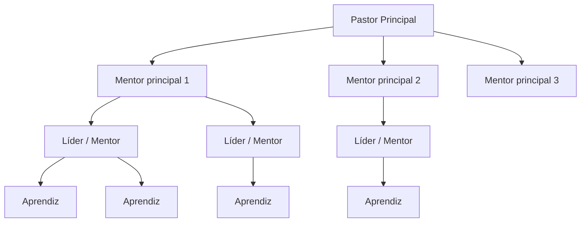
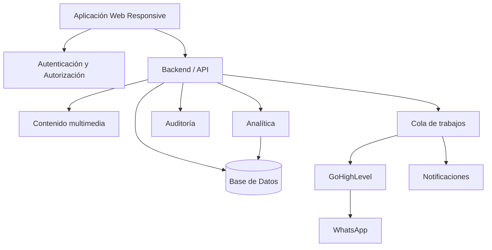

# ARQUITECTURA_VISUAL.md
# Arquitectura funcional y visual

## 1. Mapa de transformación

```mermaid
flowchart LR
    A[Persona nueva] --> B[GANAR]
    B --> B1[Registro]
    B1 --> B2[Operación 72]
    B2 --> B3[Asignación de mentor]
    B3 --> B4[Alpha]
    B4 --> B5[Focus Day]
    B5 --> C[FORTALECER]

    C --> C1[Casa de Fe]
    C1 --> C2[12 temas en orden flexible]
    C2 --> C3[Encuentro]
    C3 --> C4[Bautismo]
    C4 --> C5[Evaluación pastoral]
    C5 --> D[ENTRENAR]

    D --> D1[Escuela Ser Líder]
    D1 --> D2[Carácter]
    D2 --> D3[Liderazgo]
    D3 --> D4[Servicio]
    D4 --> D5[Evaluación pastoral]
    D5 --> E[MULTIPLICAR]

    E --> E1[Aprobación pastoral]
    E1 --> E2[Graduación como mentor]
    E2 --> E3[Recibe aprendices]
    E3 --> A
```



## 2. Idea visual de la experiencia

```text
                         TRANSFORMACIÓN Y PROPÓSITO
                                   │
          ┌────────────────────────┼────────────────────────┐
          │                        │                        │
       APRENDIZ                  MENTOR                  PASTOR
          │                        │                        │
   Mi camino personal       Mi red y personas        Toda la iglesia
   Mi fase                  Alertas                   Árbol completo
   Próximo paso             Seguimiento               Métricas
   Devocional               Evaluaciones              Salud de líneas
   Eventos                  Notas privadas            Promociones
   Recursos                 Tareas                    Administración
```

## 3. Árbol de discipulado



Regla:
- El pastor principal ve desde `PP`.
- M1 ve su rama, no M2.
- L11 ve su rama, no L12.
- El aprendiz ve su expediente, no el árbol privado.

## 4. Arquitectura de aplicaciones



## 5. Arquitectura lógica

```text
Frontend
├── Autenticación
├── Dashboard Aprendiz
├── Dashboard Mentor
├── Dashboard Pastor
├── Perfil
├── Red
├── Ganar
├── Fortalecer
├── Entrenar
├── Multiplicar
├── Contenidos
├── Eventos
└── Administración

Backend
├── Identity & Access
├── People
├── Network
├── Transformation Journey
├── Consolidation
├── Alpha
├── Faith House
├── Training
├── Multiplication
├── Content
├── Events
├── Notifications
├── Integrations
├── Analytics
└── Audit

Data
├── Personas
├── Usuarios
├── Roles
├── Relaciones
├── Equipos
├── Fases
├── Hitos
├── Evaluaciones
├── Notas privadas
├── Asistencias
├── Eventos
├── Contenido
└── Auditoría
```

## 6. Eventos de dominio sugeridos

```text
PersonRegistered
ConsolidatorAssigned
Operation72Started
ContactAttemptLogged
VisitLogged
MentorAssigned
AlphaStarted
AlphaSessionCompleted
FocusDayCompleted
AlphaApproved
StrengthenStarted
FaithHouseTopicCompleted
EncounterCompleted
BaptismCompleted
StrengthenApproved
TrainingStarted
ServiceAssigned
TrainingApproved
MultiplicationReviewRequested
MultiplicationApproved
MentorGraduated
LearnerAssignedToMentor
DevotionalAssigned
EventRegistered
```

Estos eventos pueden disparar:
- cambios de estado;
- notificaciones;
- mensajes;
- auditoría;
- actualizaciones de dashboard;
- integraciones externas.

## 7. Vista conceptual del perfil

```text
┌─────────────────────────────────────────────────────────────┐
│ PEDRO PÉREZ                           Fase: FORTALECER      │
│ Mentor: Felipe Carvajal               Línea: Alejandro      │
├─────────────────────────────────────────────────────────────┤
│ Progreso     Próximo paso      Alertas       Próximo evento │
├─────────────────────────────────────────────────────────────┤
│ HITOS                                                       │
│ ✓ Registro   ✓ Op72   ✓ Alpha   ✓ Focus Day                 │
│ ✓ Encuentro  ✓ Bautismo   ○ Casa de Fe 8/12                 │
├─────────────────────────────────────────────────────────────┤
│ LÍNEA DE TIEMPO                                              │
│ 03/01 Registro                                               │
│ 03/02 Llamada                                                │
│ 03/03 Visita                                                 │
│ ...                                                          │
├─────────────────────────────────────────────────────────────┤
│ CONTENIDO / DEVOCIONAL / EVENTOS                            │
└─────────────────────────────────────────────────────────────┘
```

## 8. Vista conceptual del mentor

```text
┌─────────────────────────────────────────────────────────────┐
│ MI RED                                                      │
├─────────────────────────────────────────────────────────────┤
│ Alertas: 3  | Evaluaciones pendientes: 2 | Op72: 1         │
├─────────────────────────────────────────────────────────────┤
│ Pedro Pérez      FORTALECER     Casa de Fe 8/12             │
│ Ana Gómez        GANAR          Alpha 5/12                  │
│ Juan Ruiz        ENTRENAR       Ser Líder                   │
├─────────────────────────────────────────────────────────────┤
│ [Ver árbol] [Ver tareas] [Ver evaluaciones]                 │
└─────────────────────────────────────────────────────────────┘
```

## 9. Vista conceptual del pastor principal

```text
┌─────────────────────────────────────────────────────────────┐
│ IGLESIA VIVE — ESTADO GENERAL                              │
├─────────────────────────────────────────────────────────────┤
│ Ganar  | Fortalecer | Entrenar | Multiplicar | Mentores    │
├─────────────────────────────────────────────────────────────┤
│              ÁRBOL INTERACTIVO DE LA RED                   │
│                         Pastor                              │
│                    /      |      \                          │
│                  M1       M2      M3                         │
│                 / \       |       \                          │
│                ...       ...      ...                        │
├─────────────────────────────────────────────────────────────┤
│ Alertas críticas | Operación 72 | Estancamientos | Crec.   │
└─────────────────────────────────────────────────────────────┘
```

## 10. Recomendación técnica de implementación

No imponer stack desde este documento si el equipo todavía no lo ha decidido.

El stack elegido debe soportar:
- autenticación robusta;
- RBAC + alcance por red;
- base relacional;
- background jobs;
- webhooks;
- API;
- almacenamiento multimedia;
- observabilidad;
- despliegue automatizado.

Para este sistema, una base de datos relacional es la opción natural porque las relaciones entre personas, mentores, líneas, fases e historial son centrales.

## 11. Regla arquitectónica crítica

La relación de discipulado no debe modelarse únicamente como un campo `mentor_id` en la tabla persona.

Debe existir una entidad/historial de relación que permita saber:
- quién fue mentor;
- desde cuándo;
- hasta cuándo;
- por qué cambió;
- quién autorizó el cambio.

La historia no se pierde.